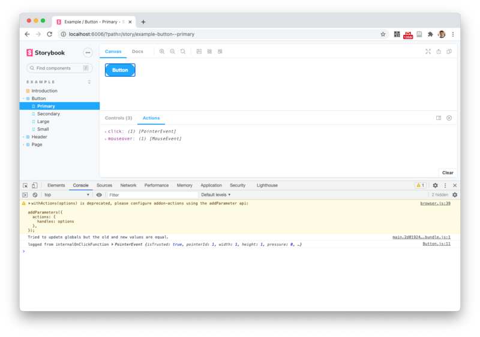
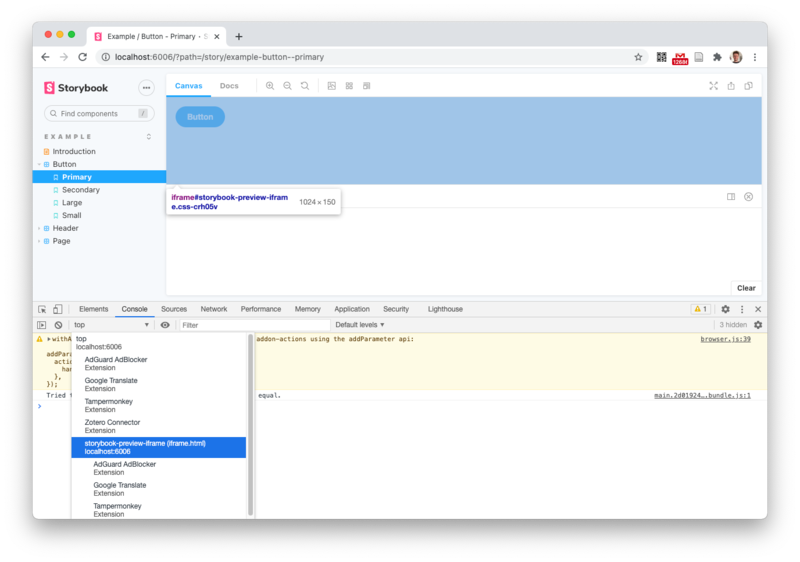
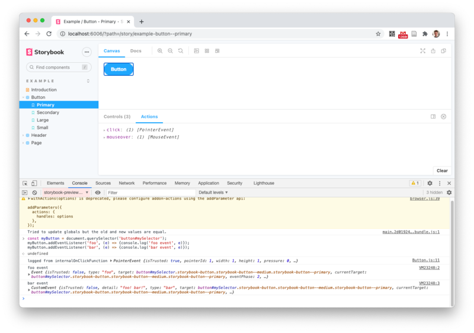

See [Button.js](stories/Button.js) and [Button.stories.js](stories/Button.stories.js).

## Usage

    npm i
    npm run storybook

Go to <http://localhost:6006>, open Browser console.

1) There's a deprecation warning that shouldn't occour with [the new configuration](https://github.com/storybookjs/storybook/blob/next/MIGRATION.md#actions-addon-uses-parameters): `withActions(options) is deprecated, please configure addon-actions using the addParameter api:`

2) Web Component's internal `console.log` works on Storybook, every standard action as well:
[](docs/screen1.png)
However, neither of the custom defined events `foo` or `bar` are shown in Actions.

3) These custom events *do* work in pure HTML, as you can verify by copy & paste into browser console:  
    1) Select right scope
        [](docs/screen2.png)
    2) Copy & Paste
        ```javascript
        const myButton = document.querySelector('button#mySelector');
        myButton.addEventListener('foo', (e) => {console.log('foo event', e)});
        myButton.addEventListener('bar', (e) => {console.log('bar event', e)});
        ```
    3) Click button
        [](docs/screen3.png)
    4) Events are fired properly, but Storyboard Actions won't show them..

## Create this repository on your own

    npm init
    npx sb init

Choose `WEB_COMPONENTS` as project type.